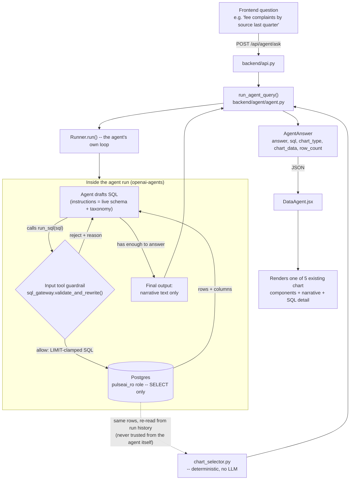

# Data Agent — architecture and safety model

A natural-language question about the feedback data ("compare fee
complaints by source last quarter") gets converted to SQL, run read-only
against Postgres, and answered with a chart plus a grounded explanation.

This is the third and final way to query the feedback data, alongside the
other two already in this repo:

- **`backend/analytics/*`** — exact, but only answers questions someone
  already wrote a function for.
- **`backend/rag/*`** — answers fuzzy, qualitative questions ("what are
  people saying about the redesign") via semantic search over weekly
  summaries, but only approximately.
- **The data agent (`backend/agent/`)** — answers *precise, quantitative*
  questions nobody wrote a function for in advance, by drafting and
  running real SQL.

This is also the only feature in the codebase that calls a paid, hosted
model (OpenAI, via the [Agents SDK](https://openai.github.io/openai-agents-python/))
instead of local Ollama. Everything else — classification, RAG, embeddings
— stays fully local and free, per this project's original design principle
(see `NOTES.md`). Drafting correct SQL (right joins, right literal casing,
no syntax errors) is a harder generation task than anything the local
`qwen2.5:7b-instruct` model has handled reliably elsewhere in this repo, so
this one route is a deliberate, scoped exception.

## Data flow



Two things are deliberately **never** trusted to the model, enforced in
code instead:

1. **Whether the SQL is safe to run.** That's the guardrail
   (`sql_gateway.validate_and_rewrite`), not the system prompt. Prompt
   instructions ("only write SELECT") are advisory; the guardrail is a
   deterministic check that runs on every single tool call, no matter what
   the model was told or asked to do.
2. **Which chart best shows the result.** That's `chart_selector.py`,
   applied *after* the agent's run completes, by re-reading the actual
   columns/rows the query returned — never the model's own guess.

Two things genuinely are delegated to the model, because they're real
language tasks it's suited for: drafting SQL syntax from a question, and
writing 2-4 grounded sentences explaining a result it has already seen.

## The safety model, layer by layer

**Layer 1 — a database role that is physically incapable of writing.**
`DATABASE_READ_URL` (see `.env.example`) points at a separate Postgres
role with only `SELECT` granted:

```sql
CREATE ROLE pulseai_ro LOGIN PASSWORD '<pick one>';
GRANT CONNECT ON DATABASE pulseai TO pulseai_ro;
GRANT USAGE ON SCHEMA public TO pulseai_ro;
GRANT SELECT ON ALL TABLES IN SCHEMA public TO pulseai_ro;
ALTER DEFAULT PRIVILEGES IN SCHEMA public GRANT SELECT ON TABLES TO pulseai_ro;
```

This is the layer that matters most: even if every other check in this
document had a bug, this role cannot `INSERT`, `UPDATE`, `DELETE`, or run
any DDL — Postgres itself refuses it. `backend/db.py` exposes this as a
second engine/session (`ro_engine`/`ROSessionLocal`), completely separate
from the app's normal read-write connection; nothing about which Python
object you call functions on decides this, only which role actually
authenticated.

**Layer 2 — the SQL validation gateway (`backend/agent/sql_gateway.py`).**
Before any LLM-drafted SQL touches Postgres, `validate_and_rewrite()`
parses it (via [SQLGlot](https://github.com/tobymao/sqlglot)) and checks,
in order:

1. Exactly one statement — rejects `; DROP TABLE ...`-shaped injection
   before even a full parse.
2. That one statement is a `SELECT` — nothing else.
3. Every table and column referenced is one this app actually has
   (`backend/agent/schema_registry.py` derives this list live from
   `backend/models.py`, never a hand-typed copy that could drift).
   Ambiguous or unresolvable columns fail closed rather than guess.
4. No dangerous functions (`pg_read_file`, `dblink`, etc.) anywhere in the
   query.
5. No write/DDL statement smuggled inside a CTE.
6. Only then: a `LIMIT` is added or clamped down to 500 rows — the *only*
   rewrite this gateway ever performs, and only after every rejection
   check above has already passed.

**Layer 3 — the retry is bounded, and failure is closed, not silent.**
A rejected query's reason is fed back to the agent as a normal tool
result (via the SDK's `reject_content` guardrail behavior), so it can draft
a corrected query in the same run — but only up to `AGENT_MAX_TURNS`
(default 8, env-configurable). If no valid, safe query is ever produced,
`run_agent_query` raises `AgentQueryFailed`, and `POST /api/agent/ask`
returns `422` — never a fabricated answer.

## What none of this can catch

Worth stating plainly, not hiding: the gateway validates **structure**,
never **meaning**. A query that is syntactically valid, touches only
allowed tables/columns, and is nevertheless *wrong* — e.g. filtering
`sentiment = 'negative'` for a question that was actually about
`feedback_type = 'complaint'`, or silently skipping the
`fact_feedback_category` join and answering a broader question than was
asked — passes every check here, executes, and gets confidently narrated
as fact. The only defenses against this are prompt/instruction quality
(the agent's instructions include a couple of worked boundary-case
examples specifically for this) and the human backstop of the "View SQL"
disclosure in the UI, which exists specifically so a wrong-but-valid query
is at least checkable by eye.

**Also worth being honest about: the agent's `temperature=0` (`agent.py`) reduces
run-to-run variance but does not make it fully deterministic**, unlike this
repo's local Ollama calls (`llm_client.py`), which are genuinely
byte-identical at `temperature=0` because they run on hardware you control
with greedy decoding. OpenAI's hosted serving infrastructure (batching,
MoE routing) does not give the same guarantee — the exact same question
was observed, in testing, to sometimes draft valid SQL and sometimes
exhaust `AGENT_MAX_TURNS` without ever producing SQL the gateway accepted,
for reasons that aren't visible or controllable from this codebase. A 422
("try rephrasing it more specifically") is the correct, designed response
to this, not a sign something is broken — but don't expect asking the same
question twice to always behave identically.

## File map

```
backend/agent/
├── schema_registry.py   allowlist of tables/columns/enum-literals, derived
│                          live from backend/models.py + backend/schemas.py
├── sql_gateway.py         the validation gateway described above -- pure
│                          function, no LLM/DB dependency
├── chart_selector.py      deterministic result-shape -> existing chart
│                          component mapping
├── context.py             the object carried through one agent run
│                          (holds the read-only DB session)
├── tools.py               the run_sql tool + its input guardrail
├── agent.py               the Agent definition + run_agent_query()
│                          orchestration
├── test_sql_gateway.py    pure-function tests -- no DB, no network
├── test_chart_selector.py pure-function tests -- no DB, no network
└── test_tools.py          integration tests against the real read-only
                             role (requires Postgres running locally)
```

## Setup

In addition to this project's normal setup (see `README.md`):

1. Create the `pulseai_ro` role with the SQL above (against your local
   Postgres — same `psql` you already used to set up the `pulseai` role).
2. Set `DATABASE_READ_URL` in `.env` to that role's connection string.
3. Get an OpenAI API key and set `OPENAI_API_KEY` in `.env`. **Never** put
   a real key anywhere except `.env` (which is gitignored) — not in a
   default value in code, not in any tracked file. Treat a key that ends
   up anywhere else as compromised and rotate it immediately.
4. `AGENT_MODEL` (default `gpt-4.1-mini`) and `AGENT_MAX_TURNS` (default
   `8`) are both optional overrides in `.env`.

## Running the tests

```
uv run pytest backend/agent/
```

`test_sql_gateway.py` and `test_chart_selector.py` need nothing but Python
— they're the right place to add a new case any time a new rejection rule
or chart shape is added. `test_tools.py` needs Postgres running locally
with the `pulseai_ro` role already created; it proves the read-only
guarantee end to end, including that a rejected write doesn't leave the
session's transaction stuck for the next query.

There is currently no automated test that runs the actual `Agent`/`Runner`
against the live OpenAI API — that requires a real `OPENAI_API_KEY` and
costs real (if small) money per run, so it's a manual verification step
(ask a real question through the running dashboard) rather than part of
the automated suite.
