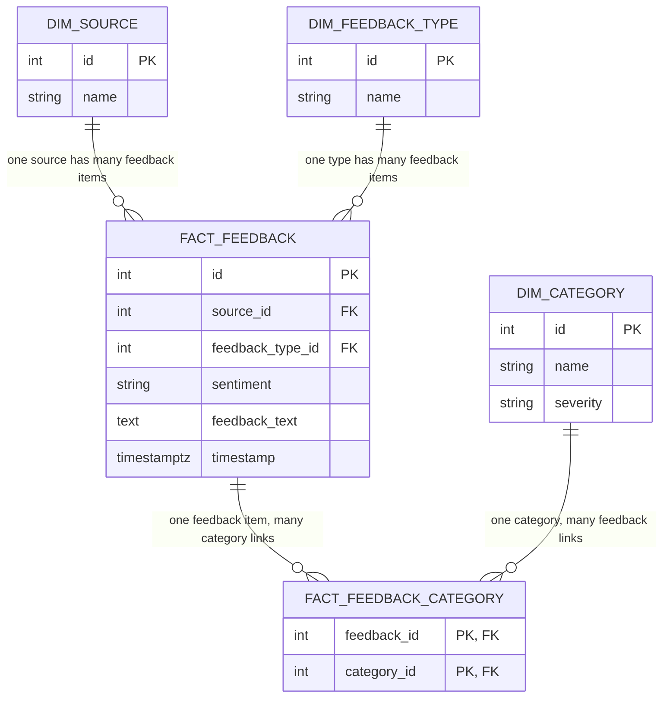

# PulseAI — Data Model (Phase 2)

Star schema for the enriched feedback data, implemented in `backend/models.py` and
loaded by `backend/pipeline/model.py`. Renders as a diagram directly on GitHub, or
in any Mermaid-aware Markdown viewer.

## Reading the diagram

- **`fact_feedback`** is the fact table — grain is one row per feedback item, same `id` as `feedback_enriched.json`.
- **`dim_source`** / **`dim_feedback_type`** — plain reference tables, linked to `fact_feedback` with a normal one-to-many foreign key (`||--o{`), since every feedback item has exactly one source and one feedback type.
- **`dim_category`** is *not* linked to `fact_feedback` directly — `category` is multi-label, so a single FK column can't represent it. Instead it connects through **`fact_feedback_category`**, the bridge table: notice both its columns are marked `PK, FK` — the *combination* of the two is the primary key, which is what allows one feedback item to link to several categories without duplicating any `fact_feedback` row.
- `severity` lives on `dim_category` as a hardcoded business-impact rating (Critical/High/Medium/Low/Unclassified) — never computed from the data, never touched by the LLM.

Full reasoning behind these choices (why a bridge table, why severity is hardcoded, why there's no `dim_date`) is in `NOTES.md`.
